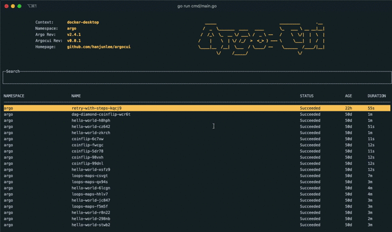

# ArgoCUI

[](https://GitHub.com/Naereen/StrapDown.js/graphs/commit-activity)
[](https://godoc.org/github.com/hanjunlee/argocui)


It support to manage Argo resource by CUI.


## Overview

The simple video clip for Argo CUI.



## Command

```
Usage of acui  
  -debug
    	Debug mode.
  -trace
    	Debug as trace level.
  -ro
    	Read only mode. Some features such as terminate and delete doesn't work.
```

## Keybinding

### List

 Key | Description
-----|-------------
 `/` | Set the search current view.
 `k` | Move cursor up.
 `j` | Move cursor down.
 `H` | Move cursor up to the upper bound.
 `L` | Move cursor down to the bottom.
 `ctrl + l` | Display logs from Argo workflow.
 `ctrl + g` | Display the tree of Argo workflow.

### Search

 Key | Description
-----|-------------
 `enter` | Search Argo workflows which is matched with the pattern.
 `ctrl + u` | Clean.

### Logs & Tree

 Key | Description
-----|-------------
 `k` | Move cursor up.
 `j` | Move cursor down.
 `H` | Move cursor up to the upper bound.
 `L` | Move cursor down to the bottom.
 `esc` | Back to the list view.

## Changelog

[CHANGELOG.md](./docs/CHANGELOG.md)

## Contribute

[CONTRIBUTE.md](./docs/CONTRIBUTE.md)

